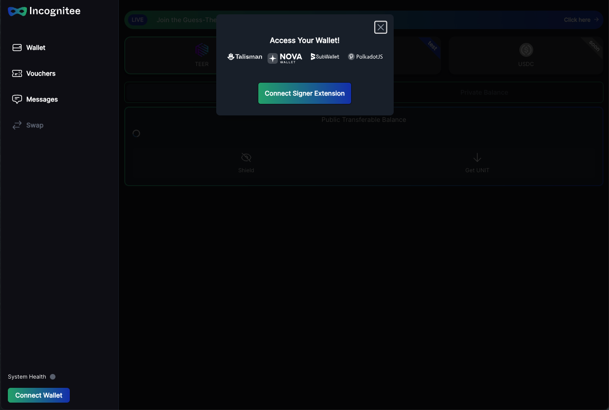

# 2.1 Get started with Incognitee Live Net

### Incognitee on Integritee Network Wallet 

The first beta version of Incognitee is now live on Integritee Network. \
Follow the link : [https://app.incognitee.io/](https://app.incognitee.io/)

Once you enter the website, you will see the Incognitee wallet, where you can connect your wallet from one of the providers mentioned.&#x20;

1. The first step is to connect your wallet.&#x20;

<figure><figcaption></figcaption></figure>

2. Once you are connected, you will see your wallet in the bottom left corner.&#x20;

<figure><figcaption></figcaption></figure>

3. You can now also close the pop-up screen and continue interacting with the wallet. Now you can also see on the top, that you are currently active on the Integritee Network. In the center of the screen, you can see your current public transferable balance. From here you can now either shield your balances to the private L2 or switch to your private balance.

<figure><figcaption></figcaption></figure>

4. By selecting "Shield" you can now transfer your TEER to the private L2 layer.

<figure><figcaption></figcaption></figure>

5. Switching now to the private balance, you can either send or receive TEER tokens privately and instantly without leaving any trace on chain. Or you can unshield the TEER tokens anytime back to layer 1.

### Under the hood 

**Check sidechain activity**

Visit the [Integritee Network explorer](https://polkadot.js.org/apps/?rpc=wss%3A%2F%2Fkusama.api.integritee.network#/explorer) where you can see events whenever sidechain blocks get finalized:

<figure><figcaption></figcaption></figure>

As privacy is our main feature, you can’t see much more here. The `BlockHeaderHash` helps you proving that you sent funds to someone. By default, recipients just observe a change in their balance but they have no clue where the funds come from unless you tell them and provide a merkle proof for the sidechain block inclusion of your transfer.

However, as shielding and unshielding events are publicly happening on Integritee, you can observe shielding/unshielding activity on the vault account on [subscan](https://integritee.subscan.io/account/2KBaZn1mvdp6oJbSWJ5ffRWmTZ44STuqgm8Zbau4oaLRKR1u?tab=transfer).

The balance of the vault account will always exactly match the total supply on the respective sidechain shard.

**What are shards and mrenclaves?**

Each instance of an Incognitee sidechain is identified by a _shard identifier_ and we’ll need to tell the validators which shard we’d like to talk to. Think of it like the genesis hash of a L1 blockchain.

The `MRENCLAVE` identifies the validator code which is executed in Intel SGX enclave (it’s basically the hash of the enclave binary). Your call will only execute if the validator runs the code you expect it to run.

**Why should I trust validators?**

Because they can’t cheat and they can’t see your data. That’s what TEEs guarantee. But how should you know that the validators actually run the correct code in a TEE? You can authenticate validators thanks to Integritee’s remote attestation registry at [enclaves.integritee.network](https://enclaves.integritee.network).

There you can find the validator for this tutorial if you search for the url you’re using `wss://integritee-1.cluster.securitee.tech:2000` and it will tell you the verified MRENCLAVE which has been remotely attested using [our decentralized DCAP process](https://docs.integritee.network/4-development/4.5-attesteer).

### **Incognitee Portal**  

The portal has separate sections with privacy-supported features:&#x20;

* Wallet
* Vouchers
* Messages
* TEERdays

**Wallet:**\
\
In this section, you can select the asset you want to transfer. After connecting your wallet via the bottom left button “Connect Wallet”, you can start transferring assets from public Layer 1 to the confidential Layer 2.\
\
Actions that are available:\
\
**Shielding:**\
Shielding is the process of transferring an asset from an origin chain like TEER on Integritee to Incognitee, which is still public. Thereby your wallet is sending the amount to a vault on the source chain, and the same amount will be available on the same wallet address on Incognitee.\
\
**Private Transfer:**\
A private transfer, is a transfer between two Incognitee wallets which is done completely in private.

**Unshielding:**\
You can transfer your asset back from L2 to L1 anytime if you would like to continue on the transparent ledger.&#x20;

&#x20;
